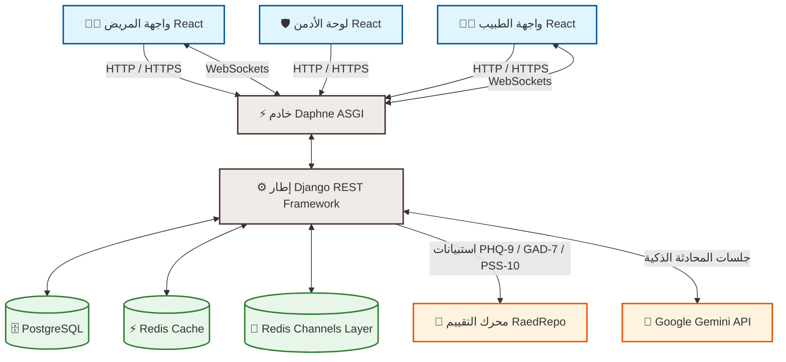

# 🧠 MindMate - Mental Health Platform

**MindMate** هي منصة طبية متكاملة للصحة النفسية تهدف إلى سد الفجوة بين المرضى والأطباء النفسيين من خلال تقديم أدوات تتبع ذكية، تحليلات مبنية على خوارزميات طبية معتمدة، وتجربة تواصل سلسة وآمنة ومحمية.

---

[](https://www.python.org/)
[](https://www.djangoproject.com/)
[](https://react.dev/)
[](https://vite.dev/)
[](https://www.postgresql.org/)
[](https://redis.io/)
[](https://ai.google.dev/)

---

## 🗺️ الهيكل المعماري للنظام (System Architecture)

يوضح المخطط التالي كيفية تدفق البيانات وتفاعل مكونات النظام المختلفة بين الواجهة الأمامية والخلفية، ومحركات التحليل والذكاء الاصطناعي:



---

## ✨ المميزات الرئيسية (Key Features)

### 🧑‍⚕️ نظام التوصية والتشخيص الذكي (AI & Clinical Assessment)
* **تقييم الحالة النفسية:** استخدام خوارزميات طبية معتمدة عبر وحدة `RaedRepo` لتحليل استبيانات **PHQ-9** (مقياس الاكتئاب)، **GAD-7** (مقياس القلق)، و **PSS-10** (مقياس التوتر) واحتساب مستويات الشدة تلقائياً.
* **توصية الأطباء:** نظام ذكي يقترح الطبيب الأنسب للمريض بناءً على شدة حالته وتخصصه خلال الـ 30 يوماً الماضية.

### 👤 واجهة المريض (Patient Features)
* **المتتبع اليومي (Daily Tracker):** تتبع الحالة المزاجية (1-5) مع تسجيل الأسباب والملاحظات، مع إمكانية التحديث أكثر من مرة يومياً.
* **المذكرات اليومية (Journaling):** مساحة كتابة حرة للمريض لدعم إدخالات متعددة لنفس اليوم (Append) والاحتفاظ بسجل كامل للمذكرات.
* **إدارة الصلاحيات (Privacy & Sharing):** تحكم كامل للمريض في تشغيل/إيقاف مشاركة مذكراته أو تحليلاتها مع الأطباء المرتبطين به من لوحة التحكم مباشرة.
* **شريط التقدم والـ Streak:** تتبع نسبة إكمال المهام اليومية وحساب سلسلة الأيام المتتالية (Streak) وتقديم نصائح/اقتباسات يومية مخصصة عند إتمام المهام.
* **التوجيه الإجباري (Onboarding):** توجيه المستخدمين الجدد لإتمام الاستبيان الأولي قبل تصفح التطبيق.

### 👨‍⚕️ واجهة الطبيب (Doctor Features)
* **التسجيل المهني:** صفحة متخصصة لتسجيل الطبيب مع رفع السيرة الذاتية بصيغة (PDF) للتحقق منها.
* **لوحة تحكم الطبيب (Doctor Dashboard):** مراجعة طلبات الربط، متابعة المرضى، ومراقبة مسارات المزاج والمذكرات للمرضى الذين منحوا الصلاحية.
* **تقارير الحالة النفسية التفصيلية:** رسوم بيانية تفاعلية تلخص الأيام الصعبة والأنماط النفسية للمريض خلال 30 يوماً.

### 🛡️ لوحة الإدارة المتقدمة (Admin Dashboard v2.0)
* **نظام مراجعة وتدقيق الأطباء:** استعراض طلبات الانضمام مع إمكانية قراءة السير الذاتية (CVs) مباشرة عبر Modal مدمج، وقبولهم أو رفضهم.
* **إدارة المستخدمين والأطباء:** دليل متكامل لإدارة الحسابات مع ميزة التعطيل والتفعيل المؤقت (Soft-Delete) لحماية تكامل البيانات.
* **إحصائيات المنصة العامة:** رسوم بيانية توضح نسب التفاعل، أعداد الأطباء والمرضى، وحالة التقييمات.

### 💬 المساعد النفسي الذكي (AI Chatbot)
* **تكامل مع Google Gemini API:** استخدام نموذج `Gemini Flash` لتقديم استجابات فورية داعمة.
* **سياق محادثة ذكي:** الاحتفاظ بآخر 10 رسائل في الجلسة لضمان استمرارية السياق ودعم اللغتين العربية والإنجليزية.
* **بروتوكول الطوارئ:** رصد الكلمات المفتاحية الحساسة وتوجيه المستخدم فوراً لأرقام الدعم النفسي الرسمية عند استشعار الخطر.

### 📡 الدردشة الفورية (Real-time Chat)
* **تقنية WebSockets & Daphne:** مراسلة فورية باستخدام Django Channels و Redis.
* **تتبع حضور المستخدمين (Presence Status):** مؤشر حالة اتصال لحظي (متصل/غير متصل) للأطباء والمرضى، يتم بثه فورياً.
* **محدد معدل الإرسال (Rate Limiting):** نظام ذكي لمنع إرسال الرسائل والأحداث العشوائية (Typing, read_event) لحماية قنوات WebSocket.
* **رفع الوسائط والمرفقات (Rich Attachments):** دعم إرسال ملفات وصور بالدردشة مع قيود الحجم (10MB) ونوع الامتداد (MIME type verification).
* **مؤشرات تفاعلية:** دعم إشعارات "جاري الكتابة" (Typing Indicator) وإيصالات القراءة الفورية.
* **أرشفة وحذف غرف المحادثة:** إمكانية أرشفة أو حذف (Soft Delete) المحادثة بشكل منفرد لكل مستخدم.
* **التصفح بالـ Cursor (Cursor Pagination):** تصفح رسائل الدردشة القديمة بكفاءة عالية (صفحة بحجم 20 رسالة).

### 🔔 نظام الإشعارات المركزي (Centralized Notifications)
* **خدمة إشعارات موحدة:** تنبيهات فورية عند إرسال/قبول طلبات الربط، تلقي رسائل جديدة، أو نصائح يومية مخصصة.
* **إشعارات Web Push الفورية:** إرسال إشعارات فورية متوافقة مع Service Workers حتى أثناء إغلاق المتصفح.
* **إشعارات البريد الإلكتروني (HTML Email):** إرسال رسائل بريد إلكتروني منسقة بوضع ليلي جذاب.
* **معالجة غير متزامنة (Celery & Redis):** إرسال الإشعارات والبريد الإلكتروني في الخلفية مع ميزة إعادة المحاولة التلقائية (تصل لـ 5 مرات).
* **فحص الخصوصية وتفضيلات التنبيهات:** حماية خصوصية الإشعارات الحساسة مع تمكين المستخدمين من تعديل تفضيلات الاستلام (بريد/دفع فوري) من البروفايل.

---

## 🛠️ التقنيات المستخدمة (Tech Stack)

### الواجهة الخلفية (Backend)
| التقنية | الوصف / سبب الاستخدام |
| :--- | :--- |
| **Django & DRF** | إطار العمل الأساسي لبناء الـ RESTful APIs وإدارة الجلسات وحماية النظام. |
| **Django Channels & Redis** | التعامل مع اتصالات WebSockets وقنوات البث في غرف المحادثة الفورية وتتبع حالة الاتصال. |
| **Celery** | خادم معالجة المهام الخلفية لإرسال إشعارات البريد و Web Push بشكل غير متزامن. |
| **PostgreSQL** | قاعدة البيانات الرئيسية لحفظ البيانات الحساسة ودعم العلاقات المعقدة وميزات الـ Soft Delete وسجلات التوصيل. |
| **SQLite** | قاعدة بيانات محلية بديلة جاهزة للعمل فوراً للتطوير والاختبار السريع. |
| **drf-spectacular** | توليد توثيق تفاعلي كامل للمنصة متوافق مع معايير OpenAPI 3.0. |

### الواجهة الأمامية (Frontend)
| التقنية | الوصف / سبب الاستخدام |
| :--- | :--- |
| **React (v19.2)** | بناء واجهة المستخدم بنظام المكونات القابلة لإعادة الاستخدام. |
| **Vite (v8.0)** | أداة البناء السريع وتشغيل خادم التطوير مع ميزة التحديث الفوري (HMR). |
| **Vanilla CSS** | التنسيقات والتصميم الجمالي Premium المخصص للمنصة لتحقيق أقصى درجات المرونة. |
| **React Router DOM (v7.14)** | إدارة التوجيه والتنقل السلس بين صفحات التطبيق. |
| **Framer Motion** | إضفاء الحركات والتأثيرات الانتقالية الاحترافية للعناصر التفاعلية. |

---

## 🚀 كيفية تشغيل المشروع (Installation & Setup)

### المتطلبات الأساسية
* تثبيت **Python 3.10+**
* تثبيت **Node.js** (إصدار LTS)
* تثبيت وتشغيل **Redis Server** (مطلوب للدردشة الفورية والـ Caching)

---

### 1. إعداد وتشغيل الواجهة الخلفية (Backend)

```bash
# 1. الانتقال إلى مجلد المشروع الرئيسي
cd mindmate

# 2. إنشاء وتفعيل البيئة الوهمية (Virtual Environment)
python -m venv venv
source venv/bin/activate        # لأنظمة Linux / macOS
# venv\Scripts\activate         # لأنظمة Windows

# 3. تثبيت حزم المكتبات المطلوبة (بما فيها Celery و PyWebPush المضافة حديثاً)
pip install -r requirements.txt

# 4. إعداد متغيرات البيئة
# قم بإنشاء ملف .env في المجلد الرئيسي بناءً على إعداداتك وتأكد من إضافة GOOGLE_API_KEY للـ Chatbot

# 5. تطبيق الهجرات (Migrations) على قاعدة البيانات
python manage.py migrate

# 6. تشغيل سكربت إعداد البيانات التجريبية (يقوم بإنشاء أطباء ومرضى وبيانات متتبع لـ 30 يوماً)
python setup_demo_data.py

# 7. تشغيل خادم ASGI باستخدام Daphne (مهم جداً لدعم الـ WebSockets)
daphne -p 8000 config.asgi:application

# 8. تشغيل خادم المهام Celery في الخلفية لمعالجة الإشعارات والبريد الإلكتروني (في ترمينال منفصل)
celery -A config worker --loglevel=info
```

---

### 2. إعداد وتشغيل الواجهة الأمامية (Frontend)

```bash
# 1. الانتقال إلى مجلد الواجهة الأمامية
cd front

# 2. تثبيت الحزم والاعتمادات
npm install

# 3. تشغيل خادم التطوير
npm run dev
```
سيتم تشغيل واجهة React وغالباً ستكون متاحة على الرابط: `http://localhost:5173`.

---

## 🧪 اختبار وتدقيق النظام (Testing & Verification)

يحتوي المشروع على سكربت اختبار شامل وجاهز يختبر كافة نقاط النهاية (Endpoints) والاتصالات بما فيها الـ WebSockets:

```bash
# تأكد أولاً من تشغيل خادم Daphne على المنفذ 8000
python test_full_system.py
```
يقوم السكربت بفحص:
* اتصال الخادم والمصادقة (مرضى وأطباء).
* عمليات المتتبع اليومي والمذكرات اليومية وسجلها.
* جلب الاستبيانات وحساب درجات التقييم.
* فحص اتصال الـ WebSocket ومصافحته (101 Switching Protocols).
* محادثات الـ Chatbot والتحقق من الاستجابة.
* نظام الإشعارات.

---

## 📚 توثيق الـ API (API Documentation)

المشروع يدعم التوثيق التفاعلي لمطوري الويب والموبايل:
* **Swagger UI:** [http://localhost:8000/api/docs/](http://localhost:8000/api/docs/)
* **Redoc:** [http://localhost:8000/api/redoc/](http://localhost:8000/api/redoc/)

*ملاحظة لمطوري التطبيقات: يتوفر في المجلد الرئيسي للمشروع ملف `schema.json` و `schema.yml` بالإضافة لبيئة Postman المجهزة باسم `MindMate_Environment.postman_environment.json` للاستيراد الفوري.*

### 🔐 نظام المصادقة في الـ API
نحن نستخدم **Token-Based Authentication** مخصص:
* عند تسجيل الدخول بنجاح عبر `POST /api/accounts/login/` يتم إرجاع `token`.
* يجب تمرير هذا التوكن في الـ Header لجميع الطلبات اللاحقة كالتالي:
  `Authorization: Bearer <your_token>`

### 📡 بروتوكول الـ WebSocket للدردشة
للاتصال بغرفة دردشة معينة، يتم الاتصال بالرابط التالي:
`ws://localhost:8000/ws/chat/<conversation_id>/?token=<your_token>`

---

## 📁 هيكل المجلدات الأساسي (Directory Structure)

```text
mindmate/
├── accounts/         # إدارة الحسابات، التسجيل، الدخول، الجلسات والتحقق (Soft Delete)
├── clinic/           # علاقات الطبيب والمريض، طلبات الربط، التوصيات والتقييمات
├── tracking/         # المتتبع اليومي للمزاج، المذكرات، الاستبيانات (PHQ9, GAD7, PSS10) والتحليلات
├── survey/           # الاستبيان الأولي للمستخدم الجديد (Onboarding)
├── chat/             # نظام المحادثة المباشر ونقاط نهاية رسائل الـ WebSockets
├── chatbot/          # نظام المساعد الذكي المدمج مع Google Gemini Flash
├── notifications/    # محرك الإشعارات المركزي (إنشاء، قراءة، وحذف)
├── config/           # إعدادات مشروع Django وتكوينات الـ ASGI والـ Routing
├── external/         # خوارزميات محركات التقييم RaedRepo وتحليل المذكرات
├── front/            # تطبيق الواجهة الأمامية React (Vite)
├── requirements.txt  # الاعتمادات ومكتبات البايثون المطلوبة
└── test_full_system.py # سكربت الفحص الآلي المتكامل للنظام
```

---
**تم تصميم وتطوير منصة MindMate كبيئة طبية آمنة للصحة النفسية، مهيأة للتوسع والإنتاج الفعلي.**
